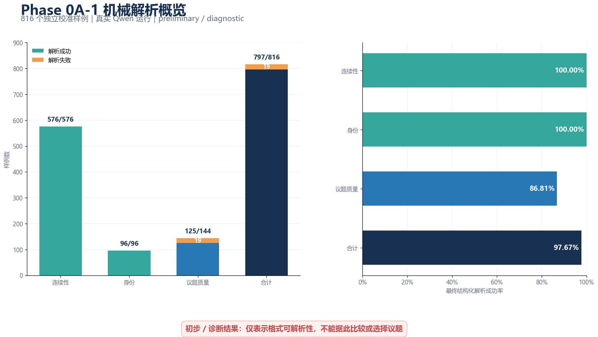
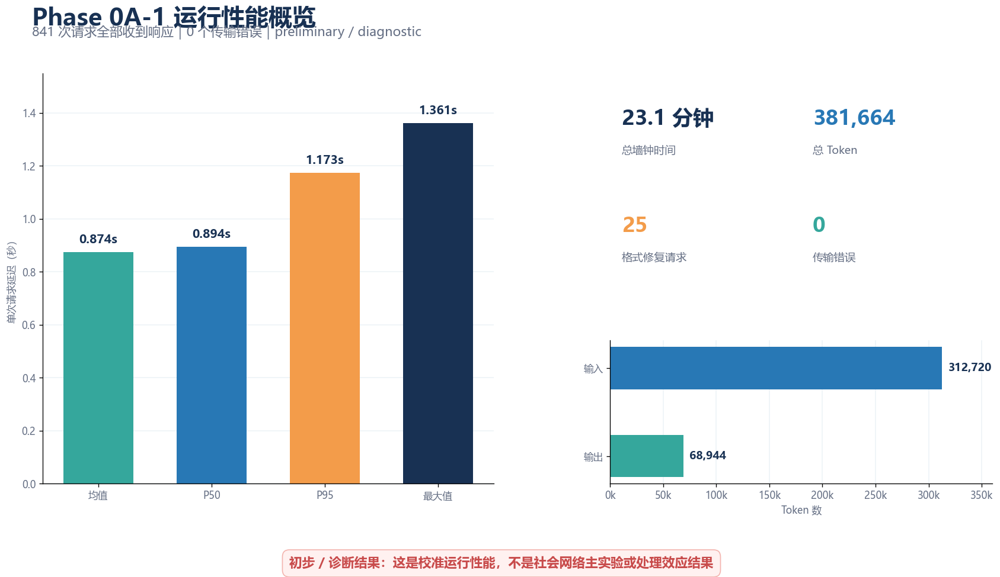

# Phase 0A-1 初步校准结果（preliminary / diagnostic）

> **用途边界：**这是 816 个独立校准样例的机器侧运行摘要，**不是社会网络主实验结果**。语义盲审和人工编码尚未完成；本文不能用于选择议题、冻结 persona，或声称网络动力学、极化、处理效应、置信区间与显著性结果。

## 一页结论

真实 Qwen 校准运行已经完整执行 **816** 个预定样例，其中 **797** 个最终结构化解析成功、**19** 个解析失败，最终解析成功率为 **97.67%**。全部 **841** 次请求均收到响应，未出现传输错误；其中包括 **816** 次语义请求和 **25** 次格式修复请求。运行墙钟时间为 **1,386.418 秒（约 23.1 分钟）**。

三个样例族的机械解析情况如下：

| 样例族 | 预定 | 解析成功 | 解析失败 | 成功率 |
|---|---:|---:|---:|---:|
| 连续性 | 576 | 576 | 0 | 100.00% |
| 身份 | 96 | 96 | 0 | 100.00% |
| 议题质量 | 144 | 125 | 19 | 86.81% |
| **合计** | **816** | **797** | **19** | **97.67%** |

解析失败全部出现在议题质量样例中；这只是**格式可解析性**现象，不等于议题语义质量排序，更不能据此选择任何议题。

## 运行性能

- 请求延迟：均值 **0.874 秒**，中位数 **0.894 秒**，P95 **1.173 秒**，最大值 **1.361 秒**。
- Token：输入 **312,720**，输出 **68,944**，合计 **381,664**。
- 终止原因：`stop` **839** 次，`length` **2** 次。
- 已生成 **797** 个盲判任务和 **174** 个人工编码任务；当前独立编码、裁决、最终标签均为 **0**，状态为 `awaiting_codes`。

## 接下来双轨推进

1. 后台继续完成 797 项盲判与 174 项确定性人工样本，补齐语义证据链；完成前不做议题选择或最终冻结。
2. 独立推进 Phase 0B 小规模真实事件诊断运行，尽快取得可用于开学汇报的初步网络实验数据；其结果必须继续标注为 preliminary / diagnostic。

## 证据定位

- 脱敏聚合文件 SHA-256：`a099c45e57eaf965e2f9e24abd806fc2836ed9fb5dcd1ae1afeb1e14c4d999d9`
- 聚合规范记录哈希：`fb40c60199398b8f50294ffdc0f792327e15733130f24cf0a14bf339388dc8c1`
- 运行 manifest 哈希：`edbc8afedecf5f9a964b7108a5e29b9e3d86c1ff122ba41e4693b62ff09a808f`
- 样例清单哈希：`93927a7266d6a7de115581d34e4efe054532e8d47c902e985151cf142c6908d1`
- 云端聚合路径：`/root/autodl-tmp/agent-ex-phase0a1-preliminary-20260920/machine-aggregate-v1.json`

本文所有数值均来自上述脱敏聚合或 `logs/2026-09-20-preliminary-report-fast-track.md`；未读取、复制或展示任何原始回答文本。
